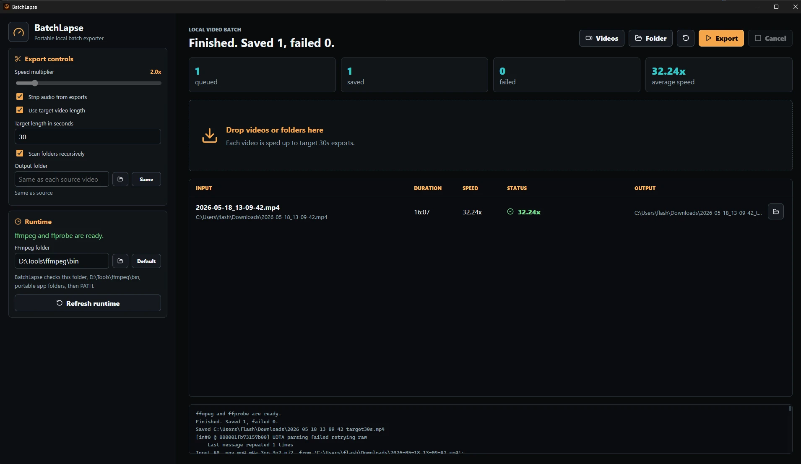

# BatchLapse

BatchLapse is a local Windows desktop batch tool for turning videos into
timelapse-style exports with FFmpeg. It uses the same Tauri + React shell style
as DepthMap AI Generator.



## Features

- Drag and drop one video, many videos, or folders.
- Batch select videos or a folder from buttons in the toolbar.
- Speed multiplier slider from 1x to 10x.
- Strip audio checkbox, enabled by default.
- Target length mode disables the multiplier and calculates the speed from each
  source duration.
- Output formats: MP4 (H.264) or WebM (VP9).
- Output folder field with same-folder output as the default.
- Per-file queue status, progress, output path, and open-output-folder button.
- Existing exports are numbered automatically unless Replace existing exports is enabled.

## FFmpeg

The app needs `ffmpeg.exe` and `ffprobe.exe`. It checks the selected FFmpeg
folder first, then portable app folders, then `D:\Tools\ffmpeg\bin`, then PATH.
Use the folder button in the Runtime panel to browse to the FFmpeg folder.

For a portable folder, put both files in `bin\` or next to the app executable.
During development, either add FFmpeg to PATH or run:

```powershell
powershell -ExecutionPolicy Bypass -File .\scripts\download-ffmpeg.ps1
```

## Development

```powershell
npm install
npm run build
npm run tauri:dev
```

## Portable Build

```powershell
npm run tauri:build
npm run portable
```

The portable package is written to `dist-portable\`. If `bin\ffmpeg.exe` and
`bin\ffprobe.exe` exist, they are copied into the portable folder automatically.
